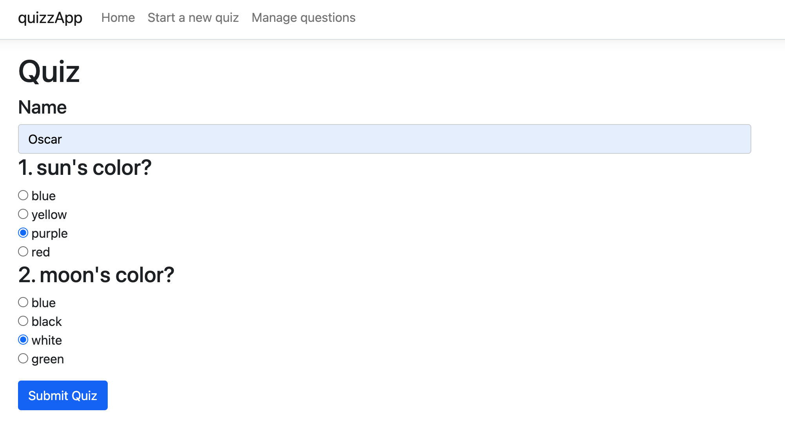
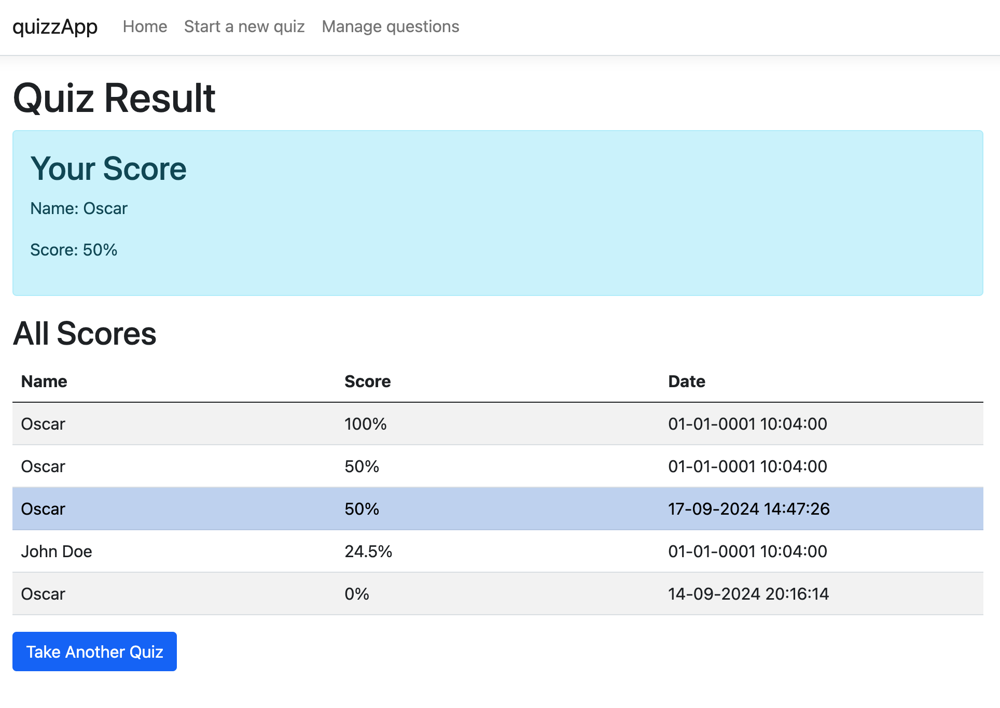
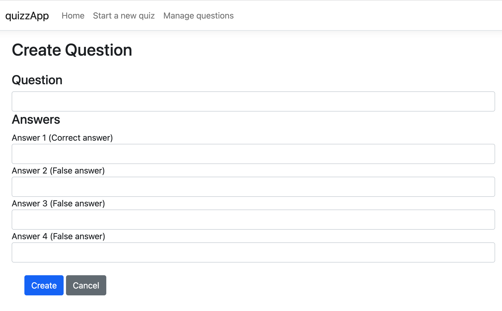
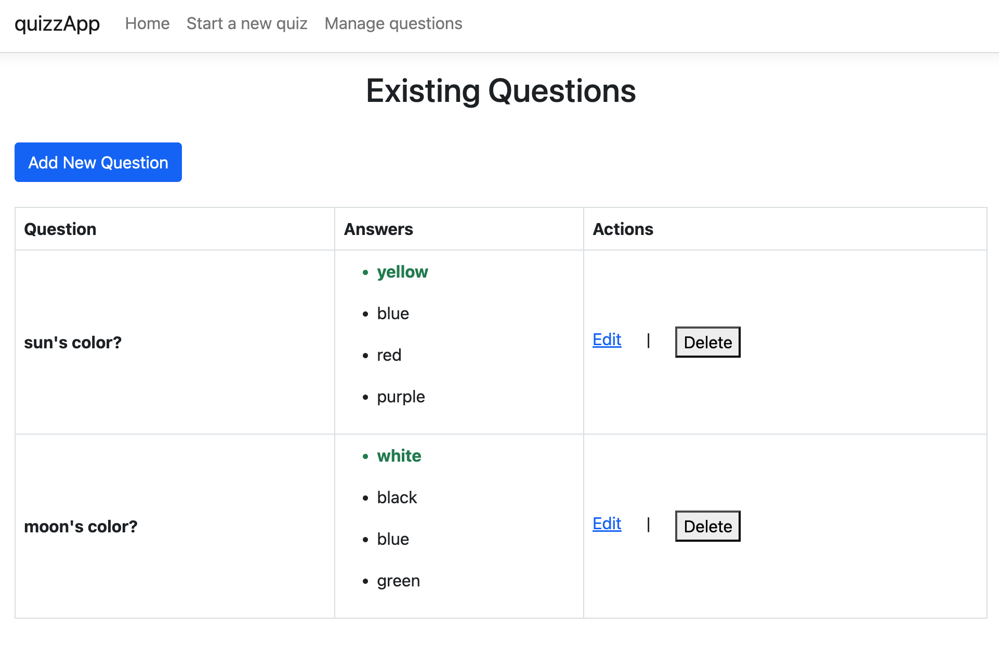

# Online Quiz Application

[](https://github.com/uwerrrr/quizzApp/actions/workflows/dotnet.yml)

This is an online quiz application that can create, manage, and participate in quizzes. This project has been implemented by using **.NET Core**, **Entity Framework**, and **Razor Pages**. 

Besides, it maintains an attractive interface that will allow users to take quizzes, keeping track of their results and managing questions.

This project is supposed to be hands-on practice for C#, .NET Core, and Entity Framework.

## Demo & Snippets

<!-- -   Hosted link: -->

### Screenshot of the app:

- **Quiz Page**: User can take a new quiz and answer the questions on this page.</br>
  

- **Result Page**: User can see their result and record of all results on this page.</br>
  

- **Question Creation Page**: User can create a new question on this page.</br>
  

- **Question Management Page**: User can view, edit, delete created questions on this page.</br>
  

---

## Requirements / Purpose

- **MVP**: Develop a basic online quiz application that allows users to create, edit, take quizzes, and view scores upon completion.
- **Purpose**: Provide a platform where users can manage and participate in quizzes.
- **Stack**:
  - Razor Pages for front-end.
  - Entity Framework Core for database operations.
  - SQLite as the database for flexibility and simplicity.

---

## Build Steps

1. Clone the repository:
   ```bash
   git clone https://github.com/uwerrrr/quizzApp.git
   ```
2. Navigate to the project directory:
   ```bash
   cd quizzApp
   ```
3. Install dependencies:
   ```bash
   dotnet restore
   ```
4. Run database migrations:
   ```bash
   dotnet ef database update
   ```
5. Run the application:
   ```bash
   dotnet run
   ```

---

## Goals / Approach

- **Main Goal**:
  Gain proficiency in C#, .NET Core, Razor Pages, and Entity Framework by building a functional project.
- **Design Goals**:
  - Simplified user interface for ease of quiz creation and participation.
  - Modular design to separate question management and quiz taking.
- **Approach**: Razor Pages was chosen for its simplicity and fast development cycle, while Entity Framework provides robust data management.

---

## Features

- **Question Management**: Create, edit, and list multiple choice questions.
- **Quiz Functionality**: Take quizzes, submit answers, and view calculated scores.
- **Front-End Pages**:
  - Homepage: Application overview.
  - Question Management: For creating and editing questions.
  - Quiz Page: Interface for taking quizzes.
  - Result Page: Displays the user's score upon finishing the quiz and displays the ranking of the current attempt among all recorded results.
- **Random Question Order**: Implemented randomization of questions and the order of their answers for each quiz attempt.
- **Question-Answer Relationship**: Utilizes a 1-to-many relationship between questions and answers.
- **Time limit**: Each quiz will have a time limit (in minutes) set to the number of questions plus an additional 2 bonus minutes.

---

## Known Issues

- Occasional delays when loading and submitting large quizzes.
- No real-time validation for question creation form.

---

## Future Goals

- Optimize database queries for faster submission.

---

## Change Logs
- [x] Added question management pages: create, edit and delete questions. 
- [x] Added quizz taking page.
- [x] Order questions randomly for every trying of the quiz.  
- [x] Created results page that includes ranking and tracking of historic results.  
- [X] Set quiz time limits based on the number of questions with additional bonus time.
- [ ] Implement Repository and Service pattern.

--- 

## What Did You Struggle With?

- **Entity Framework Relationships**: I struggled with managing the creation and updating of questions and their related answers across two separate but related entities using a 1-to-many relationship. I overcame this by learning how to properly manage Entity Framework's tracking and ensuring the correct parent entity is created before the children entities.

<!-- --- -->

<!-- ## Licensing Details

Released under MIT License. -->

<!-- --- -->

<!-- ## Further Details, Related Projects, Reimplementations

- _[Link to any related projects or client apps if applicable]_ -->
